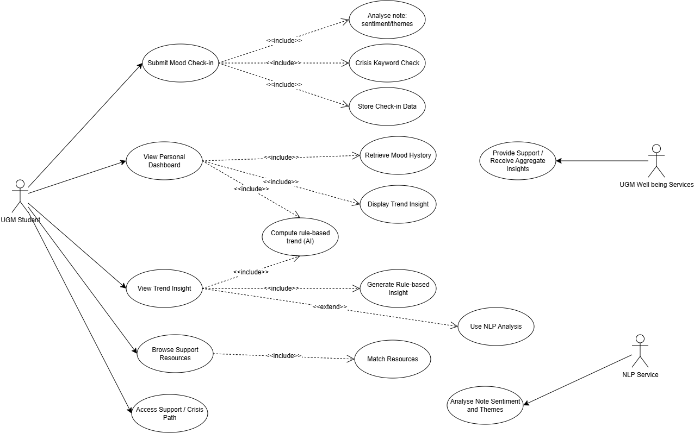
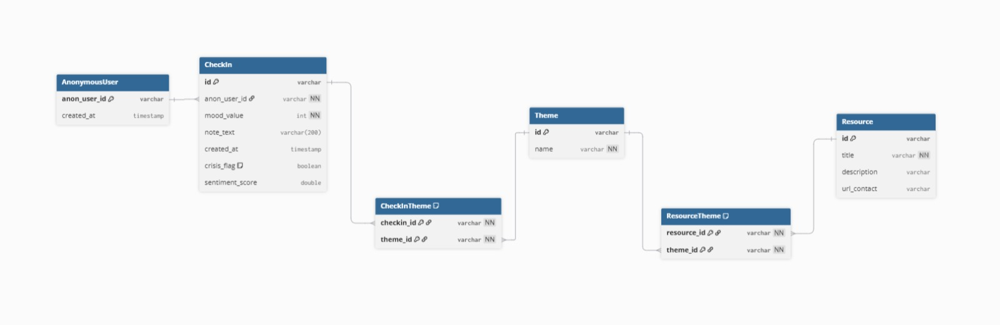
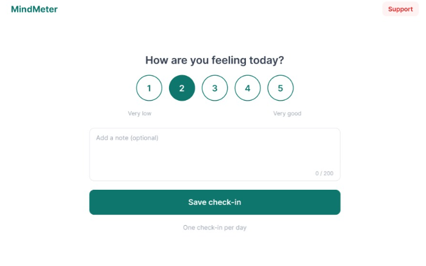
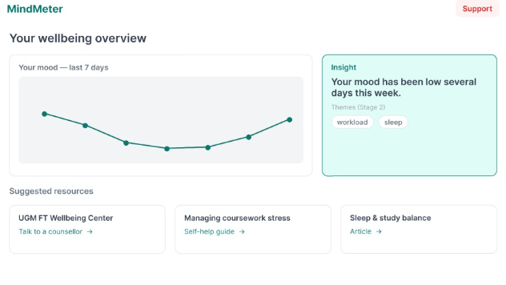
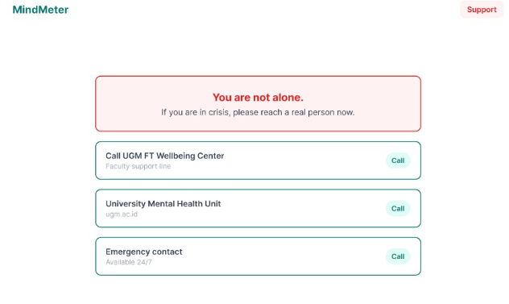

# MindMeter

**Senior Project**

Institution: Department of Electrical and Information Engineering (DTETI),
Faculty of Engineering, Universitas Gadjah Mada

## Group [ Blind leading the blind ]

| Member | NIU |
| Arya Raditya Ardana | [536660] |
| Nalen Raditya Sadewa | [536801] |
| Christania Putri Rachmadewi | [532874] |

## About the Project

- **Product name:** MindMeter
- **Product type:** Responsive web application (desktop-primary, phone-supported)
- **Background & problem:**
  Student burnout and stress have become the majority experience in higher education, both globally and in Indonesia. A 2024 national survey by the Indonesian Educational Psychology Association found that 71% of university students experienced burnout, with excessive academic pressure identified as the primary driver. This is echoed in wider Indonesian data, one student mental-health study found that only 19.8% of students showed healthy mental status, while 59.5% had moderate concerns and 20.6% exhibited poor mental health, and a 2025 study of Indonesian nursing students found 62.4% experienced moderate to severe burnout.

Internationally the picture is the same: over 55% of college students report burnout, and 37% screen positive for moderate or severe depression.
Yet the support system is failing to reach those who need it. Only about 20% of struggling students seek professional help, with roughly half held back by stigma, and many feel they lack adequate resources. Compounding this, students experiencing burnout frequently report feeling socially isolated, trapped in the belief that they alone are struggling which further discourages them from reaching out. The result is a large population of students who are stressed, unaware of their own worsening patterns, and disconnected from help.

- **Solution idea:** A private, low-friction daily mood check-in that reflects students' own trends back and keeps real UGM support one tap away. Not a diagnostic tool.
- **Competitor analysis:** Daylio, Wysa, campus counselling services

## Product Development SDLC

### Methodology

- **Methodology used:** Incremental Model, supported by Kanban-based project management using GitHub Projects.
- **Reasons:**
  1. Alignment with mindMeter’s staged scope
     The product is planned to be developed incrementally. 
     The first increment contains the core, independently usable product: daily mood check-in, secure Azure storage, personal trend dashboard, crisis-support pathway, and rule-based AI  
     The second increment adds the NLP functionality as an enhancement after the core product has been successfully implemented.
  2. Risk mitigation
     The incremental approach reduces the risk of the more technically challenging AI/NLP component. The team can also maintain a functional and demonstrable product after the first increment, even if the advanced NLP component cannot be completed within the semester.
  3. Suitability for the team and project duration
     Since the project is developed by a three-person team within a single semester. An incremental approach allows the team to divide development into smaller and more manageable deliverables while continuously progressing toward the final product.
  4. Compatibility with Kanban and GitHub Projects
     Development tasks can be organized and tracked using a Kanban workflow in GitHub Projects
  5. Allows iterative improvement
     Each increment can be reviewed and tested before additional functionality is added.

### Phase 1-3 Design

- **Product goals:**
  The primary goal of MindMeter is to enable UGM students to privately and with minimal friction track their day-to-day mood, reflect on their own emotional patterns, and keep real human support easily accessible, without diagnosing users or claiming any clinical or medical function.
   
  And also some of the few goals of MindMeter are:
  - Make the core mood check-in a single-tap action so that recording a student's daily mood feels instant and requires minimal effort.
  - Transform a student's own mood history into simple, plain-language trends using transparent rule-based logic rather than black-box AI.
  - Ensure that students showing crisis-related signals are directed toward real UGM human support before relying on any AI-generated output.
  - Ensure that students remain anonymous and that the product's usefulness does not depend on identifying individual users.

- **Potential product users and their needs:**
  1. UGM Student,
     a student that experiencing academic pressure or burnout who wants to reflect on their wellbeing but may be hesitant to use clinical or potentially exposing services.
      
     Key needs : Private and non-judgmental mood logging; a quick one-tap check-in; awareness of personal mood patterns; an easily accessible route to real human support; and a strong guarantee of anonymity.
  2. UGM Wellbeing Services,
     Includes services such as the FT Wellbeing Center and the university Mental Health Unit. These services represent the potential organizational customer in the licensing model and aim to reach and support students earlier.  
      
     Key needs: A trustworthy, non-diagnostic signposting channel that can direct students toward appropriate human support. Anonymous aggregate signals may be considered as a future capability but are explicitly out of scope for the current version.

- **Use case diagram:**
  

- **Functional requirements for the designed use cases:**
  | **FR** | **Description** | **Use Case** | **Stage** |
  |---|---|---|---|
  | **FR 1** | Allow a student to submit one mood check-in per day, with a mood value from 1 to 5. | Submit Check-in | S1 |
  | **FR 2** | Allow a student to attach an optional free-text note of up to 200 characters to a mood check-in. | Submit Check-in | S1 |
  | **FR-3** | Perform a crisis-keyword check on a submitted note before processing or trusting any AI output. If crisis-related keywords are detected, the system shall set `crisis_flag = true` and immediately display the full-screen support pathway. | Access Support / Crisis Path | S1 |
  | **FR-4** | Persist each mood check-in using an anonymous `anon_user_id` and a `created_at` timestamp in the Azure-hosted data store. | Store Check-in | S1 |
  | **FR-5** | Display the current student's mood history as a personal chart over time. | View Dashboard | S1 |
  | **FR-6** | Generate a plain-language trend insight using transparent rule-based logic, such as identifying a low average mood over the previous seven days or a specified number of consecutive low-mood days. | View Insight | S1 |
  | **FR-7** | Display relevant support or self-help resources based on the detected mood trend. In Stage 2, the system may additionally use detected note themes to improve resource matching. | View Insight / Browse Resources | S1 |
  | **FR-8** | Keep a support or contact option permanently visible and accessible with one tap from every screen. | Access Support | S1 |
  | **FR-9** | Send the text of a student's note to a pre-trained NLP service and display the returned sentiment and themes on the dashboard. No model training shall be performed by the system. | Analyse Note | S2 |
  | **FR-10** | Clearly state within the application that MindMeter is not a medical or diagnostic tool and shall never provide a medical diagnosis. | Cross-cutting | S1 |
  | **FR-11** | Collect no personally identifying information such as a student's name, email address, or demographic information, using only an anonymous user identifier. | Cross-cutting | S1 |

- **Entity Relationship Diagram:**
  

- **Low-fidelity Wireframe**
  1. Daily Check-in
     
  2. Dashboard
     
  3. Support/Crisis Path
     

- **Gantt-Chart**
<link rel="stylesheet" href="./image/style.css">

<table class="gantt">
  <thead>
    <tr>
      <th rowspan="2">Activity</th>
      <th colspan="12">Session</th>
    </tr>
    <tr>
      <th>1</th>
      <th>2</th>
      <th>3</th>
      <th>4</th>
      <th>5</th>
      <th>6</th>
      <th>7</th>
      <th>8</th>
      <th>9</th>
      <th>10</th>
      <th>11</th>
      <th>12</th>
    </tr>
  </thead>
  <tbody>
    <tr>
      <td>SP 1 : Repo Setup + Branch Protection</td>
      <td class="active"></td>
      <td class="active"></td>
      <td></td><td></td><td></td><td></td>
      <td></td><td></td><td></td><td></td><td></td><td></td>
    </tr>
    <tr>
      <td>SP 1 : Azure Resource group + Database</td>
      <td class="active"></td>
      <td class="active"></td>
      <td class="active"></td>
      <td></td><td></td><td></td><td></td>
      <td></td><td></td><td></td><td></td><td></td><td></td>
    </tr>
    <tr>
      <td>SP 1: CI GitHub Action + secrets</td>
      <td></td>
      <td class="active"></td>
      <td class="active"></td>
      <td></td><td></td><td></td><td></td>
      <td></td><td></td><td></td><td></td><td></td><td></td>
    </tr>
    <tr>
      <td>SP 2: Define crisis keyword list</td>
      <td></td><td></td>
      <td class="active"></td>
      <td class="active"></td>
      <td></td><td></td><td></td><td></td><td></td><td></td><td></td><td></td>
    </tr>
    <tr>
      <td>SP 2: Crisis check (server) + support screen</td>
      <td></td><td></td><td></td>
      <td class="active"></td>
      <td class="active"></td>
      <td></td><td></td><td></td><td></td><td></td><td></td><td></td>
    </tr>
    <tr>
      <td>SP 2: DB schema + all API endpoints</td>
      <td></td><td></td><td></td>
      <td class="active"></td>
      <td class="active"></td>
      <td class="active"></td>
      <td></td><td></td><td></td><td></td><td></td><td></td>
    </tr>
    <tr>
      <td>SP 2: Anonymous session (localStorage)</td>
      <td></td><td></td><td></td><td></td>
      <td class="active"></td>
      <td class="active"></td>
      <td></td><td></td><td></td><td></td><td></td><td></td>
    </tr>
    <tr>
      <td>SP 2: Check-in screen + dashboard (FE)</td>
      <td></td><td></td><td></td><td></td>
      <td class="active"></td>
      <td class="active"></td>
      <td class="active"></td>
      <td></td><td></td><td></td><td></td><td></td>
    </tr>
    <tr>
      <td>SP 2: Integrate + deploy Stage 1 to Azure</td>
      <td></td><td></td><td></td><td></td><td></td><td></td>
      <td class="active"></td>
      <td class="active"></td>
      <td></td><td></td><td></td><td></td>
    </tr>
    <tr>
      <td>SP 2: Seed demo data + Stage 1 testing</td>
      <td></td><td></td><td></td><td></td><td></td><td></td><td></td>
      <td class="active"></td>
      <td class="active"></td>
      <td></td><td></td><td></td>
    </tr>
    <tr>
      <td>SP 3: Choose NLP service + implement call</td>
      <td></td><td></td><td></td><td></td><td></td><td></td><td></td><td></td>
      <td class="active"></td>
      <td class="active"></td>
      <td></td><td></td>
    </tr>
    <tr>
      <td>SP 3: Surface themes on dashboard + test</td>
      <td></td><td></td><td></td><td></td><td></td><td></td><td></td><td></td><td></td>
      <td class="active"></td>
      <td class="active"></td>
      <td></td>
    </tr>
    <tr>
      <td>SP 4: Regression testing + bug fixes</td>
      <td></td><td></td><td></td><td></td><td></td><td></td><td></td><td></td><td></td><td></td>
      <td class="active"></td>
      <td></td>
    </tr>
    <tr>
      <td>SP 4: Polish + docs + demo prep</td>
      <td></td><td></td><td></td><td></td><td></td><td></td><td></td><td></td><td></td><td></td>
      <td class="active"></td>
      <td class="active"></td>
    </tr>
  </tbody>
</table>
